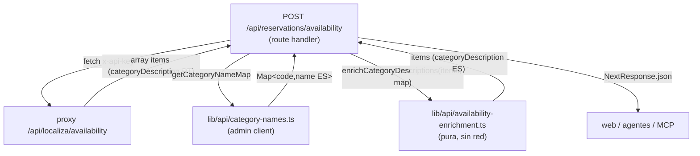

# Issue #74 — Traducción PT→ES de descripciones de categoría + confirmación de errores legibles

> Épico `amaw-sas/rentacar-web#63` · auditoría agéntica 2026-05-26 (D3) · grounding del dashboard hecho 2026-06-10
> Estado: diseño aprobado · branch `task/issue-74-category-translation` (base `1e836bd`)

## Resumen ejecutivo

El issue, escrito desde `rentacar-web`, pide dos cosas: (1) normalizar errores del motor Localiza a mensajes legibles y estables, y (2) traducir PT→ES "en origen" las descripciones de categoría (`"ECONÔMICO COM AR"`). El grounding contra el código real del dashboard reencuadra ambas:

- **Errores: ya resuelto** para los dos endpoints que consumen web y agentes. `proxy/src/localiza/warnings.ts` mapea los `ShortText` de Localiza (`LLNR*`) a `{error, message (ES), shortText, httpStatus}` vía `LOCALIZA_WARNING_MAP`, y tanto availability como reservation-create ya lanzan ese error estructurado, que el handler del dashboard reenvía verbatim. El único hueco es `check-status` (cron `check-pending`, interno), fuera de alcance por decisión de producto.
- **Traducción: no requiere un diccionario PT→ES nuevo.** La respuesta de availability ya incluye `categoryCode` (`"C"`, `"FX"`…), y el dashboard ya mantiene los nombres en español **curados** en `vehicle_categories.name`, con la misma clave `code`. La "traducción" es un **lookup por código contra la fuente de verdad existente**, no una tabla paralela que podría divergir.

El trabajo real de #74 es, por tanto, **enriquecer la respuesta de availability**: reemplazar `categoryDescription` (PT crudo) por el nombre ES curado, resuelto por `categoryCode`, en el handler del dashboard — el único origen para todos los consumidores externos (web, agentes, futuro MCP #72).

## Problema

`proxy/src/localiza/availability.ts:154` extrae `categoryDescription: attr(vehicle, "Description")` — texto crudo en portugués del SOAP de Localiza. El handler del dashboard (`app/api/reservations/availability/route.ts:80`) hace `NextResponse.json(data)` passthrough. Resultado: `rentacar-web` (`ReservationResume.vue:15` vía `useCategory.ts:57`) muestra el portugués tal cual, porque solo refleja lo que devuelve la API.

Corregirlo en presentación (web) sería un parche por consumidor. Corregirlo **en origen** (la API que todos consumen) lo arregla una sola vez para web, agentes y el MCP.

## No-objetivos

- **No** se toca el proxy: sigue siendo traductor SOAP puro, sin acoplarlo a Supabase.
- **No** se normaliza `check-status` / `check-pending` (cron interno, ningún consumidor externo lo ve). Decisión de producto.
- **No** se filtra ni reordena qué categorías aparecen. La visibilidad (status `inactive`/`restricted` como `LY`, reglas pico-y-placa) es competencia de #111, que está **bloqueado** esperando a Localiza. El mapa de traducción incluye **todos** los status precisamente porque traduce, no filtra.
- **No** se toca el flujo de pago ni `rentacar-web`.
- **Sin** migraciones de BD ni `db:types` (la tabla `vehicle_categories` ya existe y está poblada).

## Hallazgos de grounding (evidencia)

| Hecho | Evidencia |
|---|---|
| `categoryDescription` se extrae en PT crudo | `proxy/src/localiza/availability.ts:154` |
| El handler del dashboard hace passthrough | `app/api/reservations/availability/route.ts:80-81` |
| Errores ya estructurados (availability/reservation) | `proxy/src/localiza/warnings.ts` (`LOCALIZA_WARNING_MAP`, `LocalizaWarningError`); reenvío en `availability/route.ts:62-70` |
| `check-status` sin normalizar (fuera de alcance) | `proxy/src/localiza/check-status.ts:30` (`throw new Error(\`Localiza error: ${message}\`)`) |
| Nombres ES ya curados, clave `code` | `supabase/seed.sql` (`vehicle_categories`: `C`→"Gama C Económico Mecánico", `FX`→"Gama FX Sedán Automático", …) |
| Códigos alineados con Localiza | `docs/localiza/gamas-2026.md` (C, CX, F, FL, FX, FU, GC, GL, G4, GY, LE, LU, GR, P, VP, QR) |
| Política: no renombrar gamas → la tabla es fuente única | memoria `feedback_localiza_fleet_update` |
| Único de los 3 consumidores del proxy que necesita ES | `availability/route.ts` (muestra descripción); `reservations/route.ts` y `lib/reminders/check-pending-status.ts` no la muestran |
| Ruta pública sin sesión → cliente admin | `middleware.ts` `PUBLIC_API_PREFIXES` incluye `/api/reservations`; misma razón que #73 usó `createAdminClient()` |

## Arquitectura

```
proxy (SOAP → JSON, categoryDescription en PT)
   │  fetch interno (x-api-key)
   ▼
app/api/reservations/availability/route.ts  ← seam de enriquecimiento
   │  enrichCategoryDescriptions(data, await getCategoryNameMap())
   │    · code en mapa → categoryDescription = nombre ES curado
   │    · code ausente → conserva crudo + log localiza_category_unmapped
   │    · lookup lanza  → devuelve lista cruda (200, degradado) + log
   ▼
web / agentes / MCP (#72)   →  categoryDescription en español
```

`getCategoryNameMap()` lee `vehicle_categories` (empresa Localiza, **todos los status**) con el **cliente admin** (service-role) porque la ruta es pública y bypassa la sesión — no hay cookies para RLS. Es el mismo patrón validado en #73 (`lib/api/location-directory.ts`).

### Diagrama de componentes



### Flujo de datos (secuencia)

```mermaid
sequenceDiagram
  participant Cli as web / agente
  participant H as availability route handler
  participant P as proxy (SOAP)
  participant DB as Supabase (vehicle_categories)

  Cli->>H: POST availability (x-api-key)
  H->>P: fetch availability
  P-->>H: [items] categoryDescription=PT
  H->>DB: getCategoryNameMap() (admin)
  alt lookup OK
    DB-->>H: Map<code,name ES>
    H->>H: enrich → categoryDescription ES (o crudo+log si code ausente)
  else lookup lanza
    DB-->>H: error
    H->>H: log; usa items crudos (degradado)
  end
  H-->>Cli: 200 [items]
```

## Componentes

### 1. `lib/api/category-names.ts` (nuevo)

```ts
import { createAdminClient } from "@/lib/supabase/admin";

// Proyección fija; única fuente de los nombres ES (curados, protegidos por la
// política de no-renombrar-gamas). NO un diccionario PT→ES paralelo.
export const CATEGORY_NAME_COLUMNS = ["code", "name"] as const;

// Map<categoryCode, nombre ES>. Incluye TODOS los status: el mapa traduce, no
// filtra qué categorías aparecen (la visibilidad es #111, fuera de alcance).
export async function getCategoryNameMap(): Promise<Map<string, string>> {
  const supabase = createAdminClient();

  // Resolución explícita de la empresa Localiza por su code único. No existe
  // helper reutilizable (los de lib/queries/rental-companies.ts usan cliente
  // RLS); esta ruta es pública → admin. Una query trivial, latencia despreciable
  // frente al SOAP del proxy.
  const { data: company, error: companyError } = await supabase
    .from("rental_companies")
    .select("id")
    .eq("code", "localiza")
    .single();
  if (companyError) throw companyError;
  const localizaId = (company as unknown as { id: string }).id;

  const { data, error } = await supabase
    .from("vehicle_categories")
    .select(CATEGORY_NAME_COLUMNS.join(", "))
    .eq("rental_company_id", localizaId);
  if (error) throw error;

  // El `.select(...join(", "))` en forma string borra el tipo de fila (un select
  // dinámico devuelve un resultado laxo que no estrecha), así que el cast es
  // inevitable — NO "arreglarlo" a un select tipado: rompería el patrón de fuente
  // única CATEGORY_NAME_COLUMNS. Mismo precedente que lib/api/location-directory.ts.
  const rows = (data ?? []) as unknown as { code: string; name: string }[];
  return new Map(rows.map((r) => [r.code, r.name]));
}
```

**Diseño comprometido (no diferido):** se filtra por la empresa Localiza, resuelta por `rental_companies.code = 'localiza'`. Invariante de la que depende: `rental_companies.code` es `not null unique` (`supabase/migrations/002_rental_companies.sql:4`), así que el `.single()` es determinista. Se descarta explícitamente el fallback "mapear por `code` global" porque colapsaría dos nombres en uno (por orden de fila, no determinista) si una segunda empresa compartiera un `code` — un vector de bug silencioso que ningún escenario atraparía.

### 2. `lib/api/availability-enrichment.ts` (nuevo)

```ts
export interface AvailabilityItem {
  categoryCode: string;
  categoryDescription: string;
  [k: string]: unknown; // resto de campos (precio, token, IVA…) intactos
}

// Pura, sin red: testeable pasando el mapa. Reemplaza categoryDescription por
// el nombre ES cuando el código existe; conserva el crudo + log cuando no.
export function enrichCategoryDescriptions(
  items: AvailabilityItem[],
  nameMap: Map<string, string>,
): AvailabilityItem[] {
  return items.map((item) => {
    const es = nameMap.get(item.categoryCode);
    if (es) return { ...item, categoryDescription: es };
    // Gama nueva de Localiza aún no curada en vehicle_categories: nunca blanco.
    logUnmappedCategory(item.categoryCode);
    return item;
  });
}
```

`logUnmappedCategory` (en el mismo módulo `availability-enrichment.ts`) emite una línea JSON vía `console.warn` para descubrir gamas sin curar — espejo del patrón `localiza_warning_unmapped` (`warnings.ts:172-179`), pero residente en el dashboard, no en el proxy:

```ts
function logUnmappedCategory(categoryCode: string): void {
  console.warn(
    JSON.stringify({
      level: "WARN",
      event: "localiza_category_unmapped",
      categoryCode,
      timestamp: new Date().toISOString(),
    }),
  );
}
```

SCEN-002 espía `console.warn` y verifica que se emite con `event: "localiza_category_unmapped"` y el `categoryCode` ausente.

### 3. `app/api/reservations/availability/route.ts` (editar `:80`)

Reemplazar el passthrough por enriquecimiento con **degradación segura**:

```ts
const data = await proxyResponse.json();
// Solo se enriquece un array de items; si el proxy devolviera otra forma se
// pasa tal cual. La traducción NUNCA rompe disponibilidad: si el lookup de
// categorías falla, se devuelve la lista cruda (degradada) + log.
if (Array.isArray(data)) {
  try {
    const nameMap = await getCategoryNameMap();
    return NextResponse.json(enrichCategoryDescriptions(data, nameMap));
  } catch (e) {
    console.error("[availability] category enrichment failed, serving raw:", e);
  }
}
return NextResponse.json(data);
```

### 4. `docs/apidog-rentacar-api.json` (editar) — deliverable, NO escenario holdout

Añadir un campo `description` a la propiedad `categoryDescription` del schema de availability: `"Nombre de la gama (categoría) en español"`. Hoy esa propiedad tiene `example` (ya en español, `"Gama C Económico Mecánico"`) pero ningún `description`. Es coherencia con #72 (el MCP lee este OpenAPI).

**Por qué NO es un escenario:** un "drift guard" sobre esta prosa sería verde-por-construcción — el ejemplo ya es español y no hay constante compartida entre doc y handler que pueda divergir de forma falsable (a diferencia del guard real de #73, que ataba claves de schema a `DIRECTORY_COLUMNS`). Inventar una constante solo para tener un test añadiría falsa confianza. La garantía de que la salida es español la dan SCEN-001/004 sobre el código; la doc es descriptiva y se verifica por inspección en el PR.

### 5. Errores (parte 1) — confirmación, sin cambio de código

Un escenario verifica que availability ya devuelve `{error, message (ES), shortText}` ante un warning Localiza (no genérico). `LOCALIZA_WARNING_MAP` solo se extiende si aparece evidencia de un `LLNR*` conocido sin mapear (no la hay hoy).

## Manejo de errores y modos de fallo

| Modo de fallo | Comportamiento |
|---|---|
| `categoryCode` no está en `vehicle_categories` | Conserva `categoryDescription` crudo + log `localiza_category_unmapped`. Nunca blanco. |
| `getCategoryNameMap()` lanza (DB caída, admin mal configurado) | Devuelve la lista cruda (PT) con 200 + log. Disponibilidad no se rompe por traducción. |
| El éxito del proxy no es un array | El proxy siempre devuelve un array en éxito (`res.json(vehicles)`, `availability.ts:214`); el guard `Array.isArray(data)` es defensivo. Si por cualquier razón no lo fuera, passthrough sin enriquecer. La rama de error del proxy (`:59-78`) actúa **antes** de `.json()`, así que no entra aquí. |
| Warning de negocio Localiza (`LLNRAG009`…) | Ya estructurado por el proxy; reenviado verbatim. Confirmado por escenario, sin cambio. |

## Estrategia de testing

- **Unit puro** sobre `enrichCategoryDescriptions` (sin red, pasando el mapa): cubre SCEN-001/002/004/006.
- **Unit de I/O** sobre `getCategoryNameMap` mockeando `createAdminClient` (builder thenable con spies, precedente `location-directory.test.ts`): cubre SCEN-007 (call-chain de las dos queries + hilado del id + throw).
- **Unit del handler** mockeando `getCategoryNameMap` y `fetch` del proxy: cubre SCEN-003 (lookup lanza → 200 crudo), SCEN-008 (composición feliz → ES) y SCEN-005 (reenvío estructurado + rama genérica).
- El cambio de OpenAPI (`description` en `categoryDescription`) se verifica por inspección en el PR, no por un test verde-por-construcción (ver componente 4).
- Vitest, ubicación `tests/unit/api/` espejo del árbol (igual que #73). El proxy tiene su propio vitest (no se toca aquí).

## Escenarios observables (holdout SDD)

| # | Given → When → Then | Cómo |
|---|---|---|
| 001 | código en `vehicle_categories` → enrich → `categoryDescription` = nombre ES curado (no PT) | unit puro |
| 002 | código ausente del mapa → enrich → conserva crudo + log `localiza_category_unmapped` (nunca blanco) | unit puro (spy log) |
| 003 | `getCategoryNameMap` lanza → request availability → 200 con lista cruda (degradado) + log | unit handler (mock) |
| 004 | respuesta real de N items → enrich → solo cambia `categoryDescription`; precio/token/IVA intactos | unit puro (igualdad de campos) |
| 005 | (a) proxy devuelve error con body `{error,message ES,shortText}` → handler reenvía ese JSON con el **status del proxy** (no genérico); (b) body no-parseable → handler cae al genérico 502 | unit handler (mock error proxy, ambas ramas) |
| 006 | cambiar un `name` en el mapa inyectado → cambia la salida (la tabla es la fuente, no un dict hardcodeado) | unit puro (mapa inyectado) |
| 007 | `getCategoryNameMap()` → la query apunta a `rental_companies` (`eq code='localiza'`, `.single()`), luego `vehicle_categories` filtrado por el **id resuelto**, proyección = `CATEGORY_NAME_COLUMNS`; ante error de cualquiera de las dos → **lanza** (no éxito parcial) | unit (spy call-chain, precedente `location-directory.test.ts`) |
| 008 | handler: proxy ok (array PT) + mapa → respuesta enriquecida en ES con la **forma de array preservada** (composición real `enrich(data, await getCategoryNameMap())`) | unit handler (mock) |

**Anti-reward-hacking:** SCEN-006 ata la salida al mapa inyectado, garantizando que la fuente es `vehicle_categories` y no un literal PT→ES. SCEN-004 prohíbe pérdida de campos (no se puede "pasar" devolviendo solo la descripción). SCEN-002/003 prueban los caminos degradados. **SCEN-007** pinta la construcción de la query (tabla, proyección, filtro por empresa, hilado del id, contrato de throw) por spies — el mismo patrón no-tautológico de #73, NO un mock que se asegura a sí mismo; sin él un typo en `"localiza"` se desplegaría sin test. **SCEN-008** ejerce el cableado real del handler (la única prueba que compone `enrich` con el lookup), protegida por el holdout del quality gate. Se descartó el escenario de doc OpenAPI por ser verde-por-construcción (ver componente 4): un test que no puede fallar no es un escenario.

## Blast radius

- **Nuevos:** `lib/api/category-names.ts`, `lib/api/availability-enrichment.ts`, tests en `tests/unit/api/`.
- **Editados:** `app/api/reservations/availability/route.ts` (1 bloque), `docs/apidog-rentacar-api.json` (1 schema).
- **Consumidores afectados:** las 3 marcas vía el mismo endpoint; `rentacar-web` recibe ES "gratis" (sin cambio en web).
- **Riesgo:** bajo. Degradación segura preserva disponibilidad ante cualquier fallo de traducción. Un query extra (~16 filas) por availability, cacheable.
- **Sin** migraciones, `db:types`, cambios en proxy, ni cambios en qué categorías aparecen.

## Alternativas consideradas

1. **Diccionario PT→ES hardcodeado en el proxy** — rechazado: crea una segunda fuente que diverge de `vehicle_categories` (violando la política de no-renombrar-gamas) y acopla el proxy a datos de negocio que ya viven en Supabase.
2. **Enriquecer en el proxy con acceso a Supabase** — rechazado: el proxy es un traductor SOAP delgado; darle service-role + cliente Supabase lo acopla y duplica config en Railway. El dashboard ya tiene el seam y el acceso.
3. **Fix de presentación en `rentacar-web`** — rechazado por el propio issue: parchea un consumidor; agentes y MCP seguirían viendo PT.

## Trabajo futuro (fuera de alcance)

- Enforcement de visibilidad de categorías en availability (#111, bloqueado).
- Normalización de `check-status` / `check-pending` (consistencia interna).
- Convergencia de fuente única para `rentacar-web` (`web#28`).
