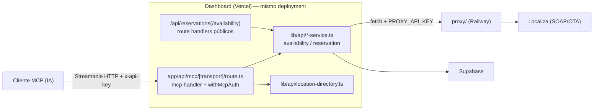
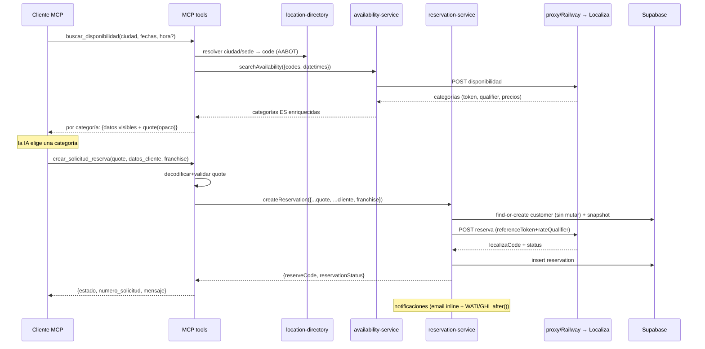

# Detailed Design — Issue #72: MCP server de reservas

**Fecha:** 2026-06-12 · **Última actualización:** 2026-06-12
**Inputs:** [discovery.md](../discovery.md) · [research/mcp-on-nextjs-vercel.md](../research/mcp-on-nextjs-vercel.md) · [research/reuse-strategy-a-vs-b.md](../research/reuse-strategy-a-vs-b.md) · [research/testing-strategy.md](../research/testing-strategy.md)

---

## 1. Overview

### Problema
La capa agéntica de reservas (épico `rentacar-web#63`) necesita un servidor MCP que exponga a clientes de IA dos herramientas — buscar disponibilidad y crear solicitud de reserva — envolviendo la integración Localiza que ya vive en el dashboard. Hoy no existe ningún MCP server; la lógica de reserva está inline en los route handlers públicos.

### Solución
Un endpoint MCP Streamable HTTP (`app/api/mcp/[transport]/route.ts`) construido con `mcp-handler`, **stateless**, autenticado con `x-api-key` (Fase 1). Dos herramientas envuelven funciones de servicio extraídas a `lib/api/` (estrategia A). El estado de cotización viaja como un **blob opaco `quote`** en los argumentos de las herramientas — la IA lo recibe de `buscar_disponibilidad` y lo reenvía a `crear_solicitud_reserva`.

### Goals
- 2 herramientas MCP funcionales sobre el flujo real de Localiza (crea reserva real, igual que `rentacar-web` hoy).
- Respuestas en español (#74), resolución `ciudad/sede → code` (#73), sin mutar customers (#25/#26).
- Auth `x-api-key`; arquitectura que admite OAuth en Fase 2 sin reescribir tools.
- Reuso behavior-preserving: el contrato de `/api/reservations*` que consumen **los dos funnels activos (`rentacar-web` + `rentacar-reservas`)** no cambia. Ver "Consumidores de la API" en [discovery.md](../discovery.md) — cualquier cambio de estructura de la API incide en ambos.

### Non-goals (Fase 1)
- OAuth / registro en Claude.ai/ChatGPT (Fase 2).
- Modo "solicitud ligera sin tocar Localiza" / estado `pendiente_confirmacion` nuevo.
- Procesamiento de pago (modelo = tarjeta presencial).
- Tests/cambios en `proxy/` (paquete separado).
- **Reservas mensuales (`selected_days >= 30`).** El MCP cubre **solo reservas estándar**: `buscar_disponibilidad` consulta Localiza, que solo cotiza estándar (un quote siempre trae `referenceToken`+`rateQualifier`). El flujo mensual del dashboard (`route.ts:180-182`, status `mensualidad`, sin token, sin proxy) **no produce cotización** → no aplica al flujo de 2 pasos. La función `createReservation` extraída sigue soportando mensual para el endpoint público; el MCP nunca lo invoca. Esto hace consistente el `QuoteContext` con token/qualifier requeridos.
- **Seguro total (`withTotalCoverage` / `total_insurance`).** Los funnels tienen una rama que recalcula `tax_fee`/`iva_fee` client-side (IVA 19% hardcoded) e incluye cobertura en el subtotal cuando el usuario activa seguro total en checkout. **Fase 1 cubre solo el caso sin seguro total** (rama dominante en prod): precios = derivación directa de los campos crudos de Localiza. Seguro total = Fase 2 (exigirá llevar campos crudos en el quote + corregir el quirk del IVA 19% hardcoded). `crear_solicitud_reserva` no expone `total_insurance` en Fase 1 (o lo rechaza si llega `true`).

---

## 2. Requirements

### Funcionales
- **FR1** `buscar_disponibilidad(ciudad, fecha_recogida, fecha_devolucion, hora?, sede?, franchise?)` → lista de categorías con `categoryCode`, descripción ES, precio total, IVA, seguro/cobertura, descuento, precio/día, días, **y un `quote` opaco por categoría**.
- **FR2** `crear_solicitud_reserva(quote, fullname, identification_type, identification, email, phone, franchise, extras?)` → `{ estado, numero_solicitud, mensaje }` tras crear la reserva real en Localiza.
- **FR3** Resolución `ciudad`/`sede` → `code` Localiza vía directorio de sedes (#73).
- **FR4** El `quote` reconstituye exactamente el contexto requerido por la creación (token+qualifier+categoría+fechas+sedes+precios+días).
- **FR5** Errores de negocio de Localiza (fuera de horario, sin inventario) se propagan como mensaje legible en español.

### No-funcionales
- **NFR1** Stateless; sin almacenamiento de sesión.
- **NFR2** `runtime = "nodejs"`, `maxDuration ≥ 120s`.
- **NFR3** Auth `x-api-key` constante-time-ish (igualdad estricta, como el precedente del repo).
- **NFR4** Sin secretos del proxy en la capa MCP (los custodia la función de servicio, como hoy).
- **NFR5** TS strict; sin `any` salvo el escape sancionado.

---

## 3. Architecture

### System context



Clave: **MCP y los handlers públicos comparten las mismas funciones de servicio** (`SVC`). El salto a Railway lo hace `SVC`, no el MCP. **Los dos funnels (`rentacar-web` + `rentacar-reservas`) siguen usando `PUB` sin cambios** — el MCP es un tercer consumidor que entra por `SVC`, no por `PUB`.

### Data flow — las dos llamadas y el `quote` opaco



---

## 4. Components

### C1 · `app/api/mcp/[transport]/route.ts` (nuevo)
Construye el handler con `createMcpHandler`, registra las 2 tools, lo envuelve con `withMcpAuth`. Exporta `GET`/`POST`. `runtime="nodejs"`, `basePath="/api/mcp"`, `maxDuration=120`.

### C2 · `lib/api/mcp/auth.ts` (nuevo)
`verifyApiKey(req): AuthInfo | undefined` — lee `x-api-key`, compara con `MCP_API_KEY`. Aislado para que Fase 2 swapee a `verifyOAuthToken` sin tocar las tools.

### C3 · `lib/api/mcp/quote.ts` (nuevo)
`encodeQuote(ctx): string` / `decodeQuote(blob): QuoteContext`. Serialización determinista (JSON → base64url) del contexto de cotización. `QuoteContext` = `{ pickupLocation, returnLocation, pickupDateTime, returnDateTime, selected_days, categoryCode, referenceToken, rateQualifier, precios... }`. `decodeQuote` valida shape con zod y lanza error legible si falta/corrupto.

### C4 · `lib/api/mcp/tools.ts` (nuevo)
Define las 2 tools (inputSchema zod + handler). Handlers: orquestan `location-directory` + `availability-service` / `reservation-service`, dan forma a la salida MCP (`content[].text` + el `quote`), mapean errores a `isError`.

### C5 · `lib/api/availability-service.ts` (nuevo — extracción behavior-preserving)
`searchAvailability(input): Promise<AvailabilityItem[]>`. Núcleo extraído de `app/api/reservations/availability/route.ts` (fetch al proxy + enriquecimiento PT→ES). El route handler público pasa a `auth → parse → searchAvailability`.

### C6 · `lib/api/reservation-service.ts` (nuevo — extracción behavior-preserving)
`createReservation(input): Promise<{ reserveCode, reservationStatus }>`. Núcleo extraído de `app/api/reservations/route.ts` (resolución refs + find-or-create + proxy + insert + notificaciones). El route handler público pasa a `auth → parse → createReservation`.

### C7 · OpenAPI (`app/api/openapi` / `docs/apidog-rentacar-api.json`) (modificación)
Completar `AvailabilityResponseItem` (faltan coverage/extraHours/discount) y documentar el endpoint MCP. Fuente de verdad del shape: `proxy/src/localiza/availability.ts:152-174`.

---

## 5. Data models

### `QuoteContext` (el blob opaco)
```typescript
// lib/api/mcp/quote.ts
const QuoteContext = z.object({
  pickupLocation: z.string(),      // code Localiza, ya resuelto
  returnLocation: z.string(),
  pickupDateTime: z.string(),      // YYYY-MM-DDTHH:mm:ss
  returnDateTime: z.string(),
  selected_days: z.number().int().positive(),
  categoryCode: z.string(),
  referenceToken: z.string(),      // OBLIGATORIO para estándar
  rateQualifier: z.string(),       // OBLIGATORIO para estándar
  total_price: z.number(),
  total_price_to_pay: z.number(),
  tax_fee: z.number(), iva_fee: z.number(),
  coverage_days: z.number(), coverage_price: z.number(),
  return_fee: z.number(),
  extra_hours: z.number(), extra_hours_price: z.number(),
});
```
`encodeQuote` = `base64url(JSON.stringify(ctx))`. Opaco para la IA; auto-contenido (sin estado servidor). No incluye datos de cliente. Token/qualifier requeridos (`z.string()` no opcional) — consistente con "solo estándar" (ver Non-goals).

### Mapeo availability item (camelCase) → QuoteContext (snake_case) — RESUELTO ✅
El item de disponibilidad (`proxy/src/localiza/availability.ts:152-174`) emite **camelCase**; el body de reserva (`route.ts:282-310`) usa **snake_case**. **Reconciliación CERRADA (2026-06-12):** se leyó el código de los DOS funnels — `rentacar-web` (`packages/logic/src/composables/useRecordReservationForm.ts` + `useCategory.ts`) y `rentacar-reservas` (`composables/useRecordReservationForm.ts` + `useCategory.ts`). **Convergen: mapeo IDÉNTICO** (mismos composables y getters). No hay divergencia → el MCP replica ese mapeo, caso **sin seguro total** (rama dominante en prod; seguro total = Fase 2, ver Non-goals).

| QuoteContext (= body reserva) | ← Availability item / cálculo | Notas |
|---|---|---|
| `categoryCode` / `category` | `categoryCode` | directo |
| `referenceToken` | `referenceToken` | directo |
| `rateQualifier` | `rateQualifier` | directo |
| `tax_fee` | `taxFeeAmount` | directo (rama sin seguro total) |
| `iva_fee` | `IVAFeeAmount` | directo (rama sin seguro total) |
| `coverage_days` | `coverageQuantity` | directo |
| `coverage_price` | `coverageTotalAmount` | directo |
| `return_fee` | `returnFeeAmount` | directo |
| `extra_hours` | `extraHoursQuantity` | directo |
| `extra_hours_price` | `extraHoursTotalAmount` | directo |
| **`total_price`** | **`totalAmount + returnFeeAmount + taxFeeAmount`** | = `getSubtotal + getTaxFeePrice` (sin seguro total). **NO incluye IVA.** |
| **`total_price_to_pay`** | **`estimatedTotalAmount`** | = `getActualTotalPrice` (sin seguro total). Incluye todo (tax+iva). Relación: `total_price + iva_fee ≈ total_price_to_pay`. NO es derivable trivialmente de `total_price`. |
| **`selected_days`** | **diff de fechas (regla >4h suma día), NO `numberDays`** | ⚠️ los funnels lo computan client-side desde el rango pickup/return, NO del item de disponibilidad. El MCP **debe replicar la misma regla** o divergirá. |
| `pickupLocation`/`returnLocation`/`pickup/return DateTime` | (no del item) | del input resuelto de `buscar_disponibilidad` |

**Campos de disponibilidad que los funnels NO envían** (solo display): `discountAmount`, `discountPercentage`, `vehicleDayCharge`, `coverageUnitCharge`, `numberDays`, `taxFeePercentage`, `extraHoursUnityAmount`. El quote no los necesita.

**Derivación de precio:** `buscar_disponibilidad` deriva `total_price`/`total_price_to_pay`/`tax_fee`/`iva_fee` con las fórmulas de arriba (rama sin seguro total) y las hornea en el `quote`. Centralizar en una función `deriveStandardPricing(item)` testeable. **Nota Fase 2:** soportar seguro total exigirá llevar los campos crudos de disponibilidad en el quote y mover la derivación a `crear_*` (depende del toggle); además el funnel hardcodea IVA 19% en esa rama — **quirk a corregir, no a copiar**.

**⚠️ Modelo de confianza heredado:** el dashboard NO recalcula ni valida precios — persiste lo que el cliente envía (proxy passthrough, `record.post.ts` reenvía verbatim). Los dos funnels ya son "fuentes de precio confiables"; el MCP hereda el mismo modelo (precio client-trusted, auth-gated). No es un defecto introducido por #72, pero queda documentado.

### `CreateReservationInput` (entrada de la función de servicio)
`createReservation` recibe un objeto explícito (no el `Request`). Campos = `QuoteContext` (cotización) **+** datos de cliente **+** contexto **+** extras opcionales. El handler público lo arma desde el body; el MCP lo arma desde `decodeQuote(quote)` + args de cliente.

```typescript
interface CreateReservationInput {
  // — cotización (del quote / body) —
  pickup_location: string; return_location: string;
  pickup_date: string; pickup_hour: string; return_date: string; return_hour: string;
  selected_days: number; category: string;
  reference_token?: string; rate_qualifier?: string;     // requeridos si selected_days < 30
  total_price: number; total_price_to_pay: number;
  tax_fee?: number; iva_fee?: number;
  coverage_days?: number; coverage_price?: number; return_fee?: number;
  extra_hours?: number; extra_hours_price?: number;
  // — cliente —
  fullname: string; identification_type: string; identification: string;
  email: string; phone: string;
  // — contexto —
  franchise: string; user?: string; attribution?: object;
  // — extras (afectan booking_type / notification_required) —
  total_insurance?: boolean; extra_driver?: boolean; baby_seat?: boolean; wash?: boolean;
  monthly_mileage?: number | string;
  flight?: boolean; aeroline?: string; flight_number?: string;
}
```
**Nota de paridad:** `total_insurance` determina `booking_type` (`standard_with_insurance`) y `notification_required` (`route.ts:258-270`). `CreateReservationInput` mantiene `total_insurance` porque el **endpoint público** lo usa (paridad con los funnels). Pero el **MCP `crear_solicitud_reserva` NO expone `total_insurance` en Fase 1** (seguro total fuera de alcance, ver Non-goals) — sí expone los otros extras (`extra_driver`, `baby_seat`, `wash`, `flight`...) como opcionales; ausentes = comportamiento estándar.

### Mapeo de salida de `crear_solicitud_reserva`
| Interno (`createReservation`) | Salida MCP |
|---|---|
| `reserveCode` | `numero_solicitud` |
| `reservationStatus` (`reservado`/`pendiente`/`mensualidad`) | `estado` |
| — (sintetizado) | `mensaje` (texto ES según estado) |

---

## 6. Error handling

| Modo de fallo | Manejo |
|---|---|
| `x-api-key` ausente/incorrecto | `verifyToken` → `undefined` → 401 MCP |
| `quote` ausente/corrupto/alterado | `decodeQuote` lanza → tool `isError: true`, mensaje "cotización inválida o expirada, vuelve a buscar disponibilidad". NO llama al proxy |
| ciudad/sede no resoluble a code | tool `isError`, lista sedes válidas |
| error de negocio Localiza (horario, inventario) | `searchAvailability`/`createReservation` propaga `shortText`/`message` del proxy → tool `isError` con ese texto ES |
| campos de cliente faltantes | zod del inputSchema rechaza antes del handler |
| proxy 5xx / timeout | tool `isError`, mensaje genérico + log; sin reserva fantasma (la creación es atómica server-side) |

Regla: las funciones de servicio **lanzan**; las tools capturan y convierten a `isError`. Los route handlers públicos mantienen su contrato actual (`NextResponse.json({error}, {status})`).

### Errores tipados — preservar el contrato exacto de `/api/reservations*`
La extracción NO es un corte limpio "post auth+parse": `route.ts` tiene `return NextResponse.json(...)` tempranos en medio del flujo (sede no encontrada `:130-135`; token/qualifier faltante `:185-190`; config proxy faltante `:195-201`; **passthrough estructurado del error del proxy** `:227-246`, del que depende la lógica de toast de los funnels — al menos `rentacar-reservas` lo consume así). Para que `createReservation` **lance** pero el handler público preserve el `{error, status}` **idéntico**, se define un error tipado que transporta status + payload:

```typescript
// lib/api/service-error.ts
class ServiceError extends Error {
  constructor(
    public status: number,
    public payload: { error: string } | Record<string, unknown>, // payload completo = passthrough proxy
  ) { super(typeof payload === "object" && "error" in payload ? String(payload.error) : "error"); }
}
```
- La función de servicio lanza `ServiceError(status, payload)` en cada punto donde el handler hoy hace `return NextResponse.json(payload, {status})`. El **passthrough del proxy** (`:234-245`) preserva el objeto `{error, message, shortText}` completo en `payload`.
- El handler público: `try { return NextResponse.json(await createReservation(input)) } catch (e) { if (e instanceof ServiceError) return NextResponse.json(e.payload, {status: e.status}); throw e }` → contrato byte-idéntico para **ambos funnels**.
- La tool MCP: captura `ServiceError`, extrae el mensaje legible ES (`payload.shortText ?? payload.message ?? payload.error`) → `isError: true`.

Esto hace **verificable** la afirmación "contrato sin cambios" también en los paths de error (no solo el happy path).

---

## 7. Testing strategy
Ver [research/testing-strategy.md](../research/testing-strategy.md). Resumen: (1) unit de funciones de servicio con proxy `fetch` y admin client mockeados (dispatch-by-table); (2) round-trip + rechazo del `quote`; (3) handlers de tools con servicios mockeados; (4) verificación manual con MCP Inspector contra branch de testing de Supabase (nunca prod).

---

## 8. Appendices

### Alternativas consideradas
- **SDK pelado vs `mcp-handler`** → `mcp-handler` (menos boilerplate, oficial Vercel). Ver research.
- **Stateful (Redis) vs stateless** → stateless; el estado viaja en el `quote`. Ver research.
- **B HTTP self-call vs A in-process** → A. Ver research.

### Future work (Fase 2+)
- OAuth (`verifyToken` swap + `/.well-known/oauth-protected-resource`).
- Posible `consultar_estado_reserva` / `cancelar_reserva`.
- Persistir precios para predicción (cruza con #45/analytics).

### Riesgos heredados al plan
- Spike zod 4 ↔ SDK antes de codear tools.
- `maxDuration` vs latencia de creación (#100).
- Extracción behavior-preserving verificada por tests del endpoint público.
